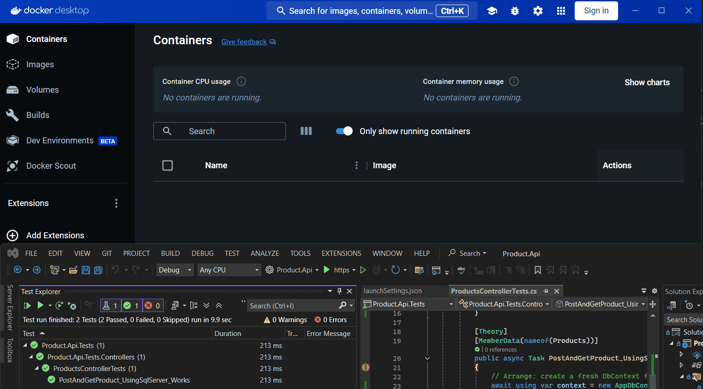

# Product API 

- This is a simple .NET 9 Web API used as an example of how to use [Testcontainers](https://testcontainers.com/).
- This project uses this specific [Microsoft SQL Server](https://dotnet.testcontainers.org/modules/mssql/) module.

Below is demo of an instance of MSSQL server spinning up in the background in docker while the tests are executed.



## Getting Started 🚀

These instructions will get you a copy of the project up and running on your local machine for development and testing purposes.

### Prerequisites

* [.NET 9 SDK](https://dotnet.microsoft.com/download/dotnet/9.0)
* [Docker](https://www.docker.com/products/docker-desktop) (for running locally and tests)

### Installation 

1. Clone the repo
   ```sh
   git clone https://github.com/reggieray/test-containers.git
   ```
2. Restore dependencies
   ```sh
   dotnet restore
   ```

## Usage 

Setup a local instance of SQL Server with docker using the following:

```sh
docker run -e "ACCEPT_EULA=Y" -e "SA_PASSWORD=YourStrong!Passw0rd" -p 1433:1433 --name sqlserver -d mcr.microsoft.com/mssql/server:2022-latest
```

The application is configured to use the settings as shown above in the connection string in `appsettings.json`.

To run the application, execute the following command from the `src/Product.Api` directory:

```sh
dotnet run
```

The API will be available at [`http://localhost:5299/swagger`](http://localhost:5299/swagger).

## API Endpoints 📄

The following endpoints are available:

*   `GET /api/products`: Get all products
*   `GET /api/products/{id}`: Get a specific product by ID
*   `POST /api/products`: Create a new product
*   `PUT /api/products/{id}`: Update a product
*   `DELETE /api/products/{id}`: Delete a product

The `Product` model has the following structure:

```json
{
  "id": 0,
  "name": "string",
  "price": 0
}
```

## Running the Tests 🧪

The project includes tests that use [Testcontainers](https://testcontainers.com/) to spin up a real SQL Server database in a Docker container.

To run the tests, execute the following command from the root directory:

```sh
dotnet test
```

## CI/CD 🛠️

A GitHub Actions workflow is configured to build and test the project on every push and pull request to the `main` branch.

- No additional setup was need to get the test container to work
- See actions tab in Github for an example or this the run was not retained, you can fork/clone this repo and run it yourself. 

## Technologies Used 🧑‍💻

*   [.NET 9](https://dotnet.microsoft.com/download/dotnet/9.0)
*   [ASP.NET Core](https://docs.microsoft.com/en-us/aspnet/core/)
*   [Entity Framework Core](https://docs.microsoft.com/en-us/ef/core/)
*   [Testcontainers for .NET](https://testcontainers.com/guides/getting-started-with-testcontainers-for-net/)
*   [xUnit](https://xunit.net/)
*   [Fluent Assertions](https://fluentassertions.com/)
